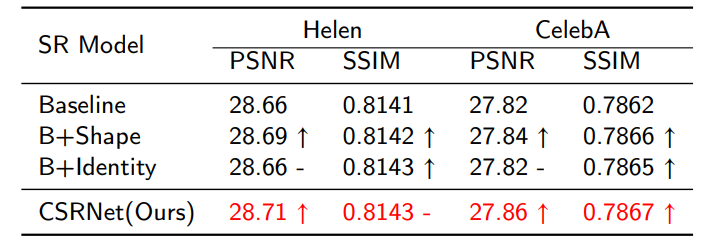

# CSRNet

## Dependencies

tensorflow 2.4.0
python 3.7.7

## Test model

test.py is used to test our models.
There are several args to set before running the .py file:

	python test.py --path ./example --model Baseline 

--path indicates the location of the images directory, please guarantee that the image size is 192x192x3. 

--model indicates use which models and we have 5 choices 'Baseline','B+Shape','B+FaceNet','CSRNet','GAN'.

For example,

	python test.py --path ./helen --model B+FaceNet
will use the images under './helen' to test our 'B+FaceNet' model.

If we do not set path and model, the program will test the images under './example' using model 'CSRNet'.
To run test.py, we need to guarantee that the models weights files : '.hdf5' files is stored in './model' directory, please download the models weight files from our cloud disk before testing.

The program will create 'X2' 'X4' 'X8' directories and a 'result.txt' file. The super-resolved images is stored in the directories. 
The PSNR and SSIM results is calculated and stored in 'result.txt'.

You can also check the performance of our model using our testset.

## Train model

train.py is the code we used to train CSRNet. 

To train CSRNet, we need to have training set and the weights of efficientnet and facenet. Our training set is construced in tfrecords format. 
We have uploaded parts of our training set to our cloud disk. Please download the '.tfrecords' files from our cloud disk and place them under './tfrecord_192' directory.
Also, please download file 'model_005602_TF2.h5' and directory 'train_IR' ,and place them under the './Code' directory. They are the weights file of efficientnet and facenet.

Then simply run: 

	python train.py 

## Dataset & model weights

link : https://pan.baidu.com/s/1vZH1Wvg-rfC6e0ckP6rQ1g 

password: y7ns 

Our test set is placed at  'dataset/helen.zip' and 'dataset/celeba' directory
while weight file of our model is placed at 'models' directory 

Part of our training set is placed at 'dataset/WebFace_train1.tfrecords','dataset/WebFace_train2.tfrecords'
### other files

Hourglass.py defines the structure of our hourglass model, while 'mtcnn' directory , inception_resnet_v1_tf2.py defines the structure of our facenet.

